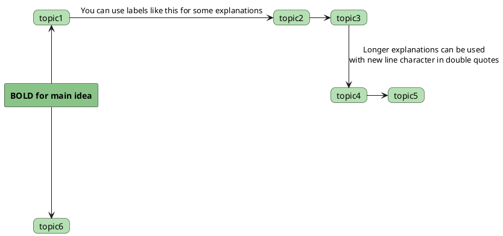

Take your time to thoroughly analyze the content – we have all the time in the world. Summarize {activeNote} in Markdown format. Use appropriate H1 to H4 headers.

### QUALITY ASSURANCE:

#### **CRITICAL: SEQUENTIAL PROCESSING RULE**
**MANDATORY**: Process the transcript in strict chronological order from start to finish. Never skip time periods.
- Start with the earliest timestamp (usually 00:00:xx)
- Process each timestamp in sequence: 00:01:xx, 00:02:xx, etc.
- When reaching 00:59:xx, the next timestamp should be 01:00:xx (not 01:59:xx)
- **NEVER jump from early minutes (00:0x:xx) directly to later hours (01:0x:xx)**
- If you reference a later point, return immediately to where you left off chronologically

**Self-Check**: Before writing each section, verify the timestamp follows logically from the previous one.
**BEFORE processing each timestamp, verify:**
1. Does this timestamp come IMMEDIATELY after the previous one chronologically?
2. If there's a gap longer than 5 minutes, STOP and state "Detected timestamp gap - please verify sequence"
3. Example: 00:08:45 → 00:12:30 ✓ (normal gap) | 00:08:45 → 01:12:30 ✗ (invalid jump)

### Priming

The transcripts come from Hungarian presentations done by art historians, historians, archeologists, linguists, astronomers and various researchers often to do with religious aspects of an older civilization's organic worldview where presenters show slides, draw on boards, etc.  

#### Screenshot placement

If you can detect where potential screenshots from the videos I should manually insert, add:  
==**SCREENSHOT HERE:**==
to highlight the area for me to add a screenshot to.  

#### PlantUML diagrams

If you think in some areas it is worthwhile to draw a diagram, use plantUML with the following syntax (no need for outer 4 backtick wrapper of course):  
````

````

The above was just to show you what syntax is expected. Use here Hungarian as well and expand cards as needed but DO NOT USE iffy directions and syntax that does not make the diagram render. If no main idea can be found, do not use rectangle but card. 
Also, these plantUML diagrams are for cases when certain main topic and subtopics are deemed worthy to be shown in diagrams. I do NOT need diagrams for the whole context of a video.  
Also, do not add diagrams in callouts or as callouts!  
Also, do NOT use computer syntax style card names with underscores such as:  
```
card rothschild_csalad as r
card fugger_csalad as f
card wilson_elnok as w
card lloyd_george_miniszterelnok as lg
card clemenceau_miniszterelnok as c
card kiralyi_kozpont_iranyultsaga as kozpont
```
...because they look really weird as 'clemenceau_miniszterelnok' instead of "Clemenceau miniszterelnök".
Make sure that when card names consist multiple text strings, they are enclosed in double quotes.
Make sure also that when using new line characters, HTML tags are closed and you need to open them again:
- WRONG: `<b>A magyarság felszámolásának\nelőkészített forgatókönyve</b>`
- RIGHT: `<b>A magyarság felszámolásának</b>\n<b>előkészített forgatókönyve</b>`

Also, explanations always should come after with colons, not embedded into arrows!
- WRONG: `palast -- "felel meg" -> vizonto`
- RIGHT: `palast ---> vizonto : felel meg`

Also, make sure you define every concept or entity to which an arrow points as a `card` or `rectangle` element, in order to avoid "null" appearances and to make the diagram much clearer and more consistent.  
But all this can lead to layout control issues. You need to ensure consistent and precise positioning of the `card` elements around the `central` rectangle, which elements always need to be declared first as in the examples above.  
Soft line breaks at the end of lines and unnecessary spaces anywhere MUST NOT be added.

If you need to add `:` somewhere where it'd break the diagram, you can use `&#58;` HTML entity. Other times, HTML entities are good ideas in plantUML diagrams.  
Note: `&#58;` is NOT needed in callouts, only in plantUML diagrams.  

#### Callouts

Insert callout boxes where relevant to expand context. Use them often (6-10 or so in a summary or more if needed) to create opportunities to break the flow of text and drive home important details. Use the following types exactly as described (both type and content of box must be preceded with `> ` as you can see) and **always** keeping empty lines between these elements:

> [!check]
> For key insights or useful information.

> [!important]
> For critical points or must-remember details.

> [!fail]
> For warnings, dangers, or failures.

> [!note]
> For notable quotes or poetic/philosophical reflections.

> [!question]
> For thought-provoking or discussion-worthy questions.

> [!example]
> For extended exploration, implications, and creative ideas.

> [!quote]
> For quotes, which is to be used sparingly, for actual quotes.

Distinguish **question** and **example** boxes: Question relates closely to the topic, while Example allows deeper, more philosophical or spiritual extensions.

### Formatting & Processing Rules:
- Ensure logical flow.
- Avoid redundant introductions and outros.
- Ignore irrelevant sections (disclaimers, social media plugs, intro/outro without subject relevance).
- Must preserve clickable timestamps for reference.
	- MANDATORY: timestamp must be added on the sentence, not on heading levels.
	- Can only add one. If more than one stamp can be attributed, then: 
		- CORRECT: `[48:43]`, `[1:01:35]`
		- INCORRECT: `[48:43, 1:01:35]`
- Ensure proper Markdown rendering: Every callout box **must** be separated from other content and other callouts by exactly ONE blank line, both before and after.  
- Summary length should match content depth - expand when meaningful, condense when generic.
	- It is important though to draw attention to potential slides or drawings the presenter displays or creates and in addition to drawing my attention to Screenshots I should make, it is important to properly analyze these subjects as well, because if the presenter (art historians, archeologists, etc.) found it important to show something, it is important for us too.
	Take your time to work through the content systematically from beginning to end. Organize headings based on the natural progression of topics as they appear, rather than attempting to reorganize by theme.

### **Hungarian Grammar Rule: In titles only first word is capitalized**

...except if the second or third word, etc. is a personal or geographical name, of course.  

❌ **Incorrect (Do not write like this!):**  
### Gyóni Géza Élete és Munkássága

✅ **Correct:**  
### Gyóni Géza élete és munkássága

### **Hungarian Grammar Rule: Maintain Definite Articles**
The summary **must include definite articles** ("a", "az") where they are required in Hungarian grammar. The model must **never omit** them at sentence beginnings or before specific nouns.

✅ **Correct:**  
- A román miniszteri tanács 1946-ban az ítélet kihirdetése előtt már bűnösnek kiáltotta ki Wass Albertet.  
- A trianoni békeszerződés következményei a mai napig érezhetőek.  

❌ **Incorrect (Do not write like this!):**  
- román miniszteri tanács 1946-ban az ítélet kihirdetése előtt már bűnösnek kiáltotta ki Wass Albertet.  
- trianoni békeszerződés következményei a mai napig érezhetőek.  

If the input transcript is missing definite articles or seemingly starts the sentences with lowercase characters, **fix it automatically.**  

### PROCESSING CHECKPOINT:
Before creating final sections, verify:
- [ ] Covered timestamps from 00:00:xx to final timestamp without hour-long gaps
- [ ] No jumps from 00:0x:xx directly to 01:0x:xx or 02:0x:xx
- [ ] All referenced content has been properly processed in sequence

### OUTPUT INSTRUCTIONS:
- Use only Markdown and consistently.
- Ensure proper sentence capitalization (uppercase letters **must** start a sentence!).
- Output only the requested sections - no additional notes or warnings.

- Maintain efficiency and consistency throughout. Use timestamps with exact clickable format as they appear in the text so each notion has its easily clicked reference.  
	- Make sure the stamps are correct: they cannot extend the length of the videos!!!
- When providing lexical items to do with vocabulary, use backticks around vocabulary items, except for personal and geography names. Use these backticks sparingly when the speaker describes the importance of a word. I do NOT want excessive backticks in the output. Only when the subject is very much to do with linguistics or etymology.
- Do NOT use escape characters before double quotes. In fact, when providing Hungarian summaries, use smart quotes.

### FINAL SECTIONS:
At the end, create these structured bullet-point sections:

**GONDOLATOK** - Minimum 10 distilled key insights.  
**IDÉZETEK** - Minimum 10 impactful direct quotes. Here, use capital letters to start sentences and double quotes, not backticks!
Make sure you also fix obvious spelling errors here; we should not copy the transcribed line word for word as it may contain syntax errors.
**TIPPEK** - Minimum 10 practical takeaways or awareness raisers.
**REFERENCIÁK** - List of relevant books, tools, projects, people and inspirations.
You can use nested lists with bolded Személyek, Könyvek/Művek, Helyszínek, Inspirációk, Fogalmak/Szimbólumok, etc., with the examples below, like so:  
- **Személyek**:  
	- Kodály Zoltán (zeneszerző)  
	- Bartók Béla (népzenekutató)  
	- Kubínyi Tamás (műsorvezető)  
- **Könyvek**/**Művek**/**Előadások**:
	- Kodály Zoltán: *A magyar népzene*  
	- Tóth Gyula: *Attila és a hun hagyomány*  
	- Zentai Ákos: *Arthur király magyar kapcsolatai*  
    - Sir Thomas Malory: *Le Morte d'Arthur* (Lovagregény)
    - Kecskeméti Vég Mihály: 55. zsoltár átültetése
    - Kodály Zoltán: *Psalmus Hungaricus*, *Háry János*, *Székelyfonó*, *Bicinia Hungarica*, *Galántai táncok*, *Hegyi éjszakák tündérzenéje*, *Te Deum*, *Missa Brevis*, *Zongorakíséretes magyar népdalok*, *Tudományos erdélyi népdalkötet*, Szóló cselló szonáta
    - Thomas Mann: *A Varázshegy*
- **Szervezetek/Projektek**:
    - Álmos Király Akadémia
    - Kodály-módszer
    - Népdalgyűjtés (Kodály és Bartók által)
- **Helyszínek**:  
	- Galánta (Kodály gyermekkori otthona)  
	- Kecskemét (Kodály szülővárosa)  
	- Nagyszombat (Kodály gimnáziumi évei)  
- **Inspirációk**:  
	- Szkíta művészeti motívumok  
	- Középkori kelta kereszt szimbolikája  
	- Magyar szent korona ikonográfiája
- **Fogalmak/Szimbólumok**:
    - Kerekasztal
    - Szent Grál
    - Excalibur
    - Pendragon vörös sárkánya
    - Isten ostora (Attila)
    - Napkorona
    - Két angyalos motívum
    - Magyar Szent Korona
    - Szent György kereszt (fehér alapon vörös)
    - Árpád-sáv
    - Lovageszmény
    - E621 (Nátrium-glutamát)

Do NOT hard-code examples from the above list!  
Make sure Inspirációk doesn't include negative ideas such as globalism if the theme is nationalistic or conservative, Islam if the theme is Christian, etc.  
Make sure the Fogalmak/Szimbólumok list doesn't include everyday notions or specific mundane things, and limit these to a most important list of dozen or so, in keeping with the messages of the content.  

After all these, at the end after an empty line, suggest 3-4 tags on a separate line for my Obsidian note taker so I can manually add them.  
If the content was mostly about an aboriginal tribe, give me their name, for example 'suár', or if it was about the Trianon treaty, offer 'trianon', always with a small letter starter.  

Also, I do NOT need notices like "Az alábbiakban ennek és ennek ilyen és olyan című előadásának összefoglalóját olvashatja." before the summaries.